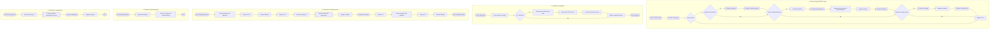

```mermaid
flowchart TD
    subgraph MAIN ["1. Bucle Principal (PROC main)"]
        Start([Inicio / PROC main]) --> H1[[Llamar Homming]]
        H1 --> LoopBase{Bucle Infinito}

        LoopBase --> Check1{¿Activar Decoración?}
        
        Check1 -- "Sí" --> DI1_1[[Llamar Homming]]
        DI1_1 --> DI1_2[[Llamar CicloDecoracion]]
        DI1_2 --> Check2

        Check1 -- No --> Check2{¿Activar Mantenimiento?}

        Check2 -- "Sí" --> DI2_1[Parada de Banda]
        DI2_1 --> DI2_2[[Llamar Mantenimiento]]
        DI2_2 --> DI2_WaitLoop[Esperar fin de señal de mantenimiento]
        DI2_WaitLoop --> DI2_5[Apagar testigo 2]
        DI2_5 --> DI2_6[[Llamar Homming]]
        DI2_6 --> Check3

        Check2 -- No --> Check3{¿Activar Farmear Aura?}

        Check3 -- "Sí" --> DI3_1[[Llamar Homming]]
        DI3_1 --> DI3_2[Parada de Banda]
        DI3_2 --> DI3_3[[Llamar FarmearAura]]
        DI3_3 --> WaitEnd
        Check3 -- No --> WaitEnd[Esperar 0.1s]
        WaitEnd --> LoopBase
    end

    subgraph HOMMING ["2. Subrutina: Homming"]
        StartP([Inicio Homming]) --> P1[Leer posición Z actual]
        P1 --> CondZ{¿Z < 400 mm?}
        
        CondZ -- Sí --> P2[Desactivar monitoreo de ejes]
        P2 --> P3[Subir robot 200 mm en Z]
        P3 --> P4[Activar monitoreo de ejes]
        P4 --> P5
        
        CondZ -- No --> P5[Mover a posición Home]
        P5 --> EndP([Fin Homming])
    end

    subgraph DECORACION ["3. Subrutina: CicloDecoracion"]
        StartC([Inicio CicloDecoracion]) --> C1[Mover Banda hacia adelante]
        C1 --> C2[Esperar 2.5s]
        C2 --> C3[Detener Banda]
        C3 --> C4[Esperar 0.5s]
        
        C4 --> C5[Encender testigo 1]
        C5 --> C6[[Ejecutar rutina de decoración]]
        C6 --> C7[Apagar testigo 1]
        
        C7 --> C8[[Llamar Homming]]
        C8 --> C9[Esperar 1s]
        
        C9 --> C10[Mover Banda hacia adelante]
        C10 --> C11[Esperar 5s]
        C11 --> C12[Detener Banda]
        
        C12 --> EndC([Fin CicloDecoracion])
    end

    subgraph MANTENIMIENTO ["4. Subrutina: Mantenimiento"]
        StartM([Inicio Mantenimiento]) --> M1[Encender testigo 2]
        M1 --> M2[Mover a posición de mantenimiento]
        M2 --> EndM([Fin])
    end

    subgraph FARMEAR_AURA ["5. Subrutina: FarmearAura"]
        StartF([Inicio FarmearAura]) --> F1[Encender testigo 3]
        F1 --> F2[[Ejecutar rutinas movimiento de aura]]
        F2 --> F3[[Llamar Homming]]
        F3 --> F4[Apagar testigo 3]
        F4 --> EndF([Fin])
    end
```
