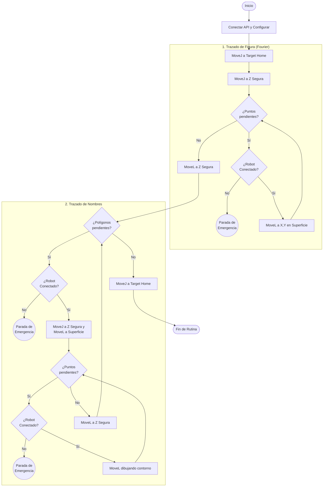

```mermaid
flowchart TD
    Inicio([Inicio]) --> Config[Conectar API y Configurar]
    Config --> Home1[MoveJ a Target Home]
    
    subgraph FIGURA ["1. Trazado de Figura (Fourier)"]
        Home1 --> ZSafe1[MoveJ a Z Segura]
        ZSafe1 --> LoopFig{¿Puntos\npendientes?}
        
        LoopFig -- Sí --> Check1{¿Robot\nConectado?}
        Check1 -- No --> Stop1((Parada de\nEmergencia))
        Check1 -- Sí --> DrawFig[MoveL a X,Y en Superficie]
        DrawFig --> LoopFig
        
        LoopFig -- No --> ZUp1[MoveL a Z Segura]
    end
    
    subgraph TEXTO ["2. Trazado de Nombres"]
        ZUp1 --> LoopLetra{¿Polígonos\npendientes?}
        
        LoopLetra -- Sí --> Check2{¿Robot\nConectado?}
        Check2 -- No --> Stop2((Parada de\nEmergencia))
        Check2 -- Sí --> ZDown[MoveJ a Z Segura y\nMoveL a Superficie]
        
        ZDown --> LoopPunto{¿Puntos\npendientes?}
        
        LoopPunto -- Sí --> Check3{¿Robot\nConectado?}
        Check3 -- No --> Stop3((Parada de\nEmergencia))
        Check3 -- Sí --> DrawTxt[MoveL dibujando contorno]
        DrawTxt --> LoopPunto
        
        LoopPunto -- No --> ZUp2[MoveL a Z Segura]
        ZUp2 --> LoopLetra
        
        LoopLetra -- No --> Home2[MoveJ a Target Home]
    end
    
    Home2 --> Fin([Fin de Rutina])
```
